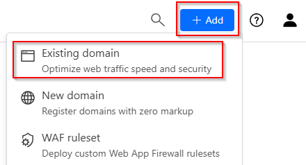
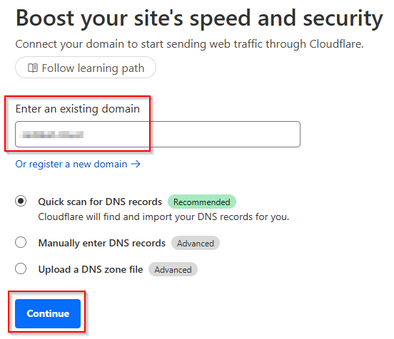

Guacamole is a remote access solution.  It uses a HTML 5 web front end to allow access to systems using remote access protocols like RDP and VNC.  A common use case for it is providing access to systems behind a firewall.

In some situations, this access may be complicated by factors such as not being able to or being unwilling to open ports.  Cloudflare has a Tunnel service where access can be given to systems in this situation without the need for inbound ports.  The architecture of this arrangement is shown below:

## Cloudflare Domain Setup
!!! note "Name Server Configuration Changes"
    Updating the name servers will usually take a while to become active.  This will potentially cause a blocker on progressing further steps.  It is suggested to do these steps well in advance

1. Go to Cloudflare website and create an account
2. Login to the dashboard, click on the Add button in the top right and select Existing domain

    

3. Enter the domain name and click Continue

    

4. Select the Free plan
5. Click the Continue to Activation button
6. Follow the instructions to update the name server records
7. Click the Continue button

## Guacamole Server - Install

1. Update packages using
    ``` shell
    sudo apt update
    ```
2. Install the prerequisite packages
    ``` { .shell .copy }
    sudo apt install build-essential libcairo2-dev libjpeg-turbo8-dev \
     libpng-dev libtool-bin libossp-uuid-dev libvncserver-dev \
     freerdp2-dev libssh2-1-dev libtelnet-dev libwebsockets-dev \
     libpulse-dev libvorbis-dev libwebp-dev libssl-dev \
     libpango1.0-dev libswscale-dev libavcodec-dev libavutil-dev \
     libavformat-dev
    ```
3. Get the latest release URL from the releases page and use wget to download it to the server:
    ``` shell
    sudo wget https://downloads.apache.org/guacamole/1.5.5/source/guacamole-server-1.5.5.tar.gz
    ```
4. Unzip the download
    ```shell
    sudo tar -xvf guacamole-server-1.5.5.tar.gz
    ```
5. Change to the extracted folder
    ``` shell
    cd guacamole-server-1.5.5
    ```
6. Run the build and install commands
    ``` shell
    sudo ./configure --with-init-dir=/etc/init.d --enable-allow-freerdp-snapshots
    sudo make
    sudo make install
    ```
7. Run the command to update the installed library cache
    ```shell
    sudo ldconfig
    ```

## Guacamole Server - Service Config

1. Reload systemd
    ``` shell
    sudo systemctl daemon-reload
    ```
2. Enable and start the service
    ``` shell
    sudo systemctl enable guacd <br>sudo systemctl start guacd
    ```
3. Verify it’s running
    ```shell
    sudo systemctl status guacd
    ```

## Guacamole Frontend - Install

1. Add the Ubuntu 22.04 repo
    ```shell
    sudo add-apt-repository -y -s "deb Index of /ubuntu  jammy main universe"
    ```
2. Install Tomcat 9 and support packages
    ```shell
    sudo apt install tomcat9 tomcat9-admin tomcat9-common tomcat9-user -y
    ```
3. Download the frontend package
    ```shell
    sudo wget https://downloads.apache.org/guacamole/1.5.5/binary/guacamole-1.5.5.war
    ```
4. Move the downloaded war file
    ```shell
    sudo mv guacamole-1.5.5.war /var/lib/tomcat9/webapps/guacamole.war
    ```
5. Restart the Tomcat and Guacmole services
    ```shell
    sudo systemctl restart tomcat9 guacd
    ```
6. Install database for database auth
    ```shell
    sudo apt install mariadb-server -y
    ```
7. Run the mysql security script to set a password for the database
    ```shell
    sudo mysql_secure_installation
    ```
8. Download the mySQL Java connector
    ```shell
    sudo wget https://dev.mysql.com/get/Downloads/Connector-J/mysql-connector-j-9.1.0.tar.gz
    ```
9. Unzip the download and move to the guac lib folder
    ```shell
    sudo tar -xf mysql-connector-j-9.1.0.tar.gz<br>sudo cp mysql-connector-j-9.1.0/mysql-connector-j-9.1.0.jar /etc/guacamole/lib/
    ```
10. Download the JDBC Auth plugin
    ```shell
    sudo wget https://downloads.apache.org/guacamole/1.5.5/binary/guacamole-auth-jdbc-1.5.5.tar.gz
    ```
11. Unzip and move files
    ```shell
    sudo tar -xf guacamole-auth-jdbc-1.5.5.tar.gz
    sudo mv guacamole-auth-jdbc-1.5.5/mysql/guacamole-auth-jdbc-mysql-1.5.5.jar /etc/guacamole/extensions/
    ```
12. Login to the MariaDB shell
    ```shell
    sudo mysql -u root -p
    ```
13. Create the user database and user
    ``` sql
    CREATE DATABASE guac_db;
    CREATE USER 'guac_user'@'localhost' IDENTIFIED BY 'password';
    GRANT SELECT,INSERT,UPDATE,DELETE ON guac_db.* TO 'guac_user'@'localhost';
    FLUSH PRIVILEGES;
    ```
14. Exit the MariaDB shell
    ``` sql
    EXIT;
    ```
15. Change to the mySQL schema directory
    ```shell
    cd guacamole-auth-jdbc-1.5.5/mysql/schema
    ```
16. Import the schema files
    ```shell
    cat *.sql | mysql -u root -p guac_db
    ```
17. Edit the guac properties file
    ``` shell
    sudo vi /etc/guacamole/guacamole.properties
    ```
18. Add connection details for the database
    ```
    mysql-hostname: 127.0.0.1
    mysql-port: 3306
    mysql-database: guac_db
    mysql-username: guac_user
    mysql-password: password
    ```
19. Restart services
    ```shell
    sudo systemctl restart tomcat9 guacd mysql
    ```

## Guacamole Frontend - Install

1. Access the frontend’s URL (ie. http://192.168.1.x:8080/guacamole/), you should see a login page
2. Login with the default credentials of guacadmin
3. Change the default password
4. Add required connections
