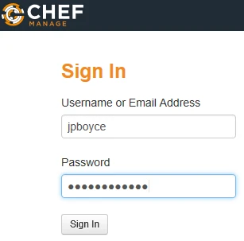
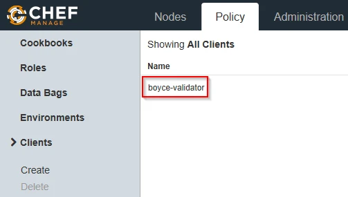
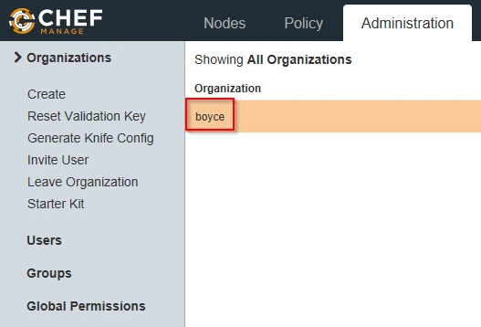
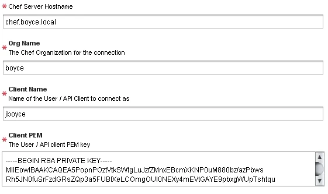

# Chef Server 12.x Install

1. Provision a Linux host
2. Download the installer onto the host
    ``` shell
    cd /tmp
    # wget https://packages.chef.io/files/stable/chef-server/12.18.14/el/7/chef-server-core-12.18.14-1.el7.x86_64.rpm
    wget https://packages.chef.io/files/stable/chef-server/13.0.17/el/7/chef-server-core-13.0.17-1.el7.x86_64.rpm
    ```
3. Install Chef server
    ``` shell
    # rpm -Uvh /tmp/chef-server-core-12.18.14-1.el7.x86_64.rpm
    rpm -Uvh /tmp/chef-server-core-13.0.17-1.el7.x86_64.rpm
    ```
3. Start all the Chef services
    ``` shell
    chef-server-ctl reconfigure
    ```
5. Create an administrator account. This command will generate an RSA private key, which is the private key for that user.  Specifying the --filename option allows you to specify the path
    ``` shell
    chef-server-ctl user-create USER_NAME FIRST_NAME LAST_NAME EMAIL 'PASSWORD' --filename FILE_NAME
    ```
6. Create an organisation.  This command will generate an RSA private key, which is the chef-validator key.
    ``` shell
    chef-server-ctl org-create short_name 'full_organization_name' --association_user user_name --filename ORGANIZATION-validator.pem
    ```
7. Install the management console
    ``` shell
    chef-server-ctl install chef-manage
    chef-server-ctl reconfigure
    # chef-manage-ctl reconfigure
    # Newer versions need the accept license flag in the command
    chef-manage-ctl reconfigure --accept-license
    ```
8. Logon to the Chef Manage console to verify things are working, using the administrator account details from step 5

    

9. Go to the Policy tab and the Clients menu item.  Verify there is an item for ORGNAME-validator

    

10. Click on the Administration tab and under Organisations, verify there is an item for your organisation

    

To add the Chef server to vRO's inventory, run the Add Chef Host workflow (Library > CHEF > Configuration).  Fill in the form items and submit the workflow


