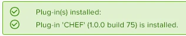

1. Download the Plugin from the Chef Plugin page on the VMware Exchange ([https://marketplace.vmware.com/vsx/solutions/chef-plugin-for-vrealize-orchestrator?ref=company](https://marketplace.vmware.com/vsx/solutions/chef-plugin-for-vrealize-orchestrator?ref=company))
2. Login to the vRO control center (https://<vRO>/vco-controlcenter/config)
3. Navigate to "Manage Plugins"
4. Under the heading "Install Plugin" click the Browse button and select the Plugin download
5. Click on the Upload button
6. If the install is successful, you will see a confirmation similar to below

    