# FAS Setup

!!! warning "Deprecated Content"

    This content relates to the Citrix Xenapp Essentials product, which has been discontinued

1. Run the installer and complete it
2. Load the Administration Console

    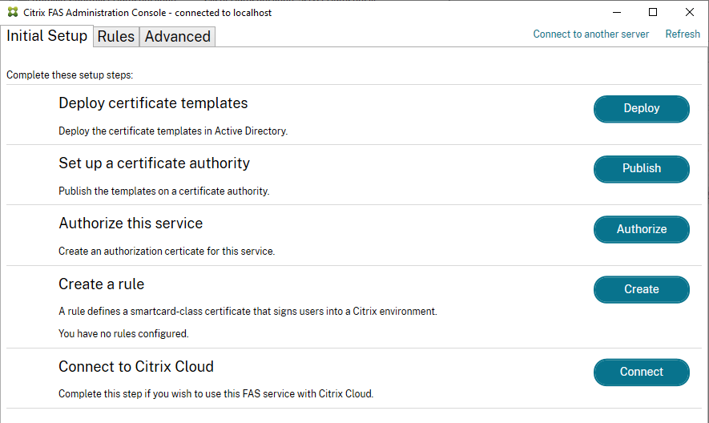

3. Click on the Deploy certificate templates item.  You will see a prompt about the certificates that will be installed.  Click OK.  The status should update with a green tick if successful

    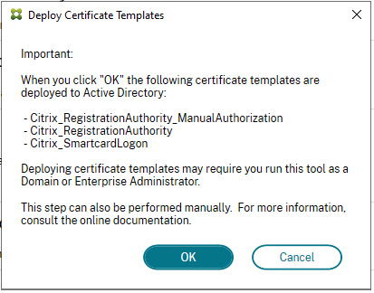

4. Click on the Publish button for the 2nd item.  A prompt will appear again with info about the cert templates and to select the Certificate Authority to publish to.  Click OK to complete the deployment.

    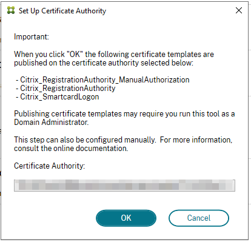

5. If you manage the certificate authority, the cert templates should appear as available when this step is completed

    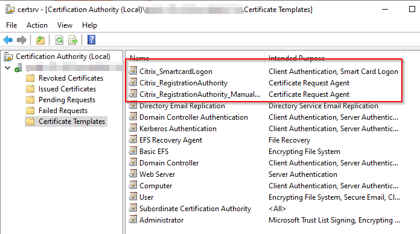

6. Click on the Authorise button.  A confirmation window will appear, select the CA and click OK.  The step will sit in a pending state (spinning waiting icon).

    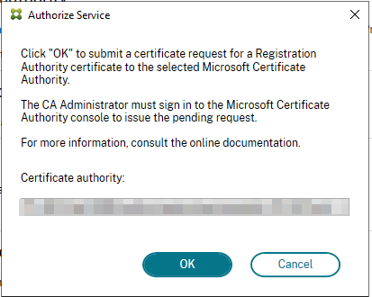

7. Go to your CA MMC and navigate to Pending requests

    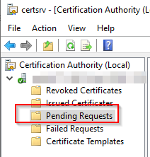

8. There should be a pending request from the FAS server.  Right-click and select All Tasks > Issue

    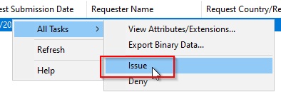

9. The Authorise set in the FAS setup should update with a positive result.
10. Click on the Create button for the Create a Rule task.  This will start the Create a Rule wizard.  For now, select the creation of a default rule.

    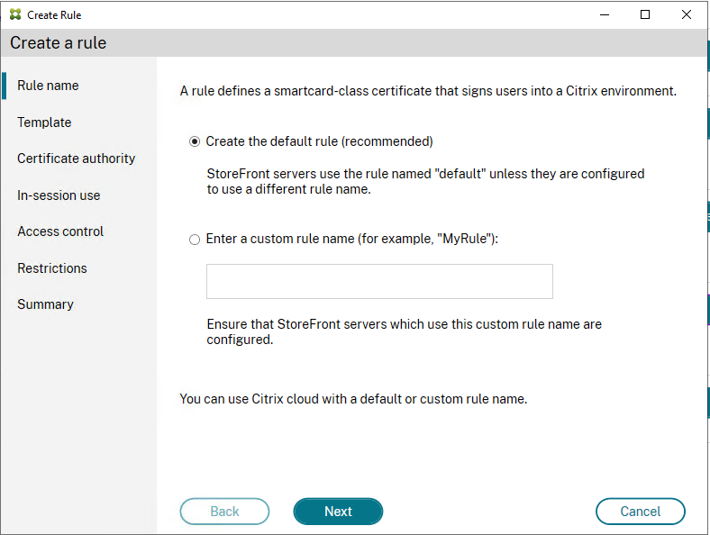

11. Once the wizard has been completed, click on the Connect button to connect to Citrix Cloud.  The wizard will start.

    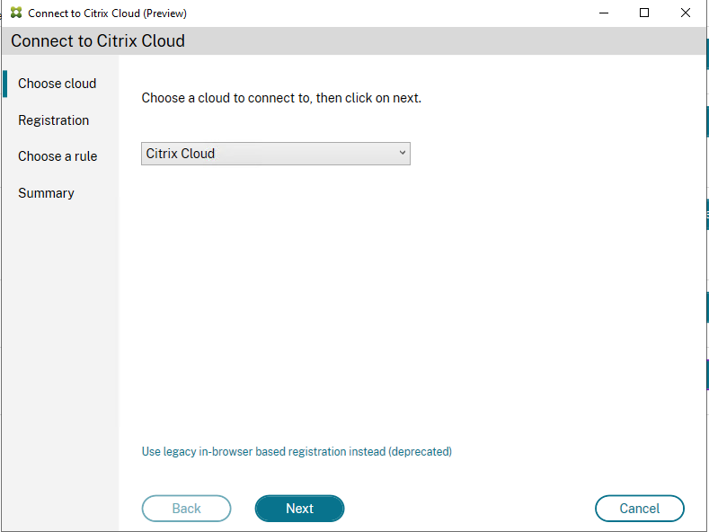

12. As per the instructions, copy the Confirmation URL into a browser with internet access and the code.

    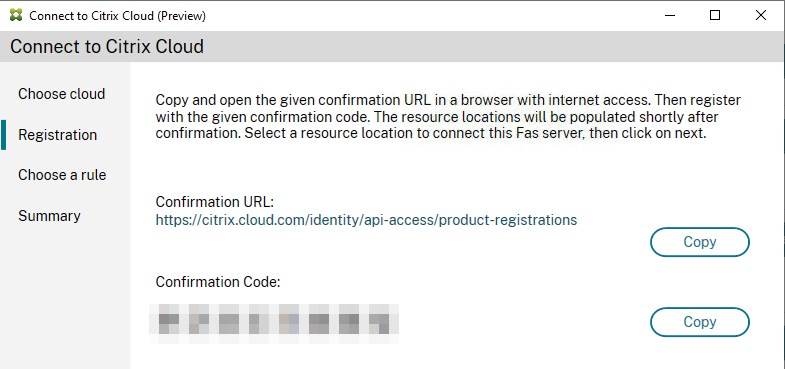

13. In the browser, click on Register button

    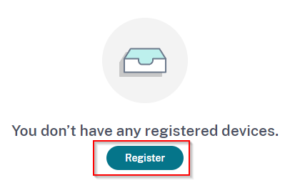

14. Enter the confirmation code

    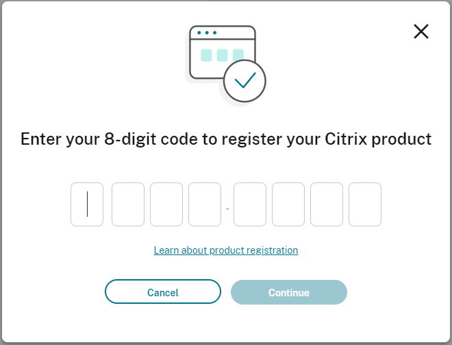

15. A confirmation screen will appear with details of the registration.  Review and click Register

    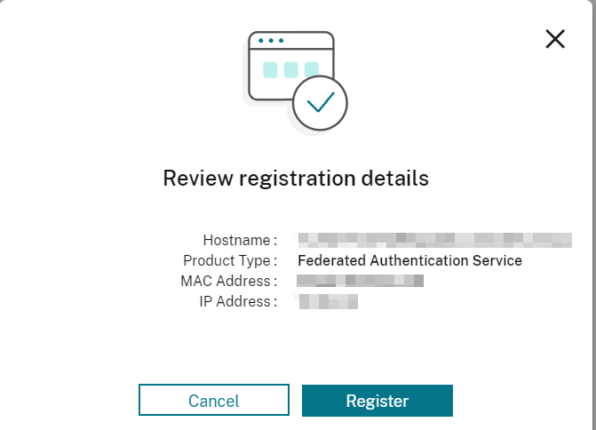

16. Once the registration is completed on the Citrix Cloud side, the FAS wizard should update with the resource location to select.

    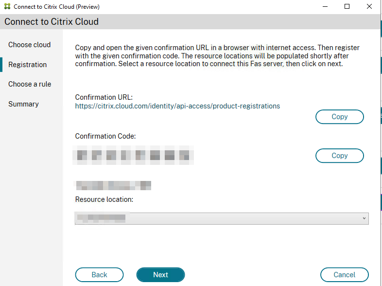

17. In the Choose a rule prompt, select the appropriate option (most likely use an existing rule since we created the default one)

    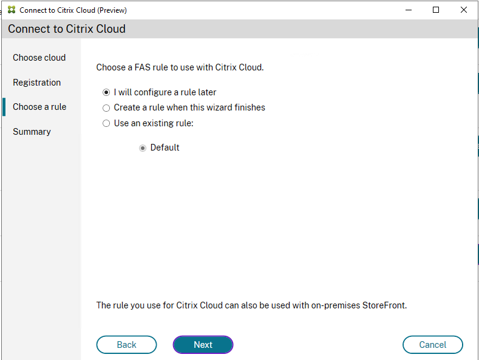

18. Review the summary screen and click Finish
19. Setup a GPO that sets the FAS Server for appropriate targets as per Install and configure | Federated Authentication Service (citrix.com)
