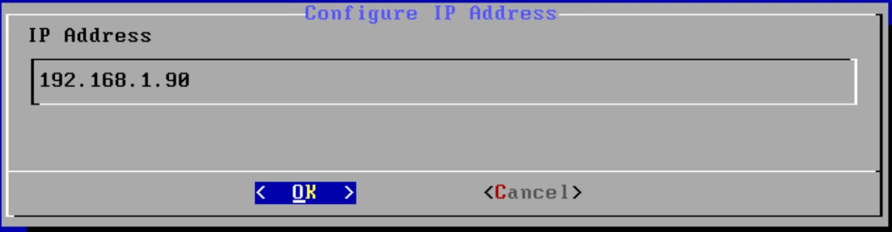
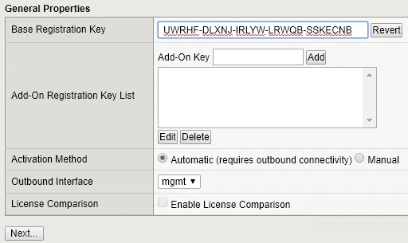
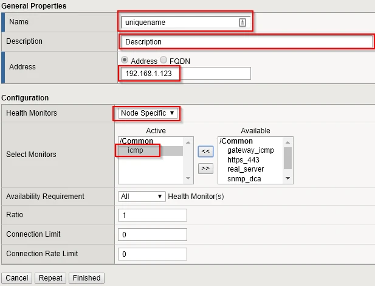

## Installation & Configuration of Virtual Appliance

1. Deploy appliance as normal and boot
2. Login to the console with the default credentials (root/default)
3. Run the config command
4. Set an IP address for the management interface or leave as DHCP

    

5. Access the management interface on the new set IP address (https://<IP>/) with the default management credentials (admin/admin)
6. Start the Setup Utility
7. Click the Activate License button and fill in the details in the form

    

8. Accept the License Agreement
9. The configuration process will start.  When it is finished click the Continue button
10. Continue the Setup wizard to completion

## Create a Node

1. Navigate to Local Traffic > Virtual Servers > Nodes
2. Click on Create
3. Enter details

    

4. Click on the Finished button