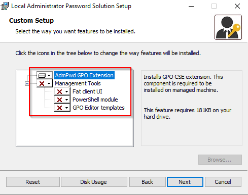

# LAPS

## Summary

The "Local Administrator Password Solution" (LAPS) provides management of local account passwords of domain joined computers. Passwords are stored in Active Directory (AD) and protected by ACL, so only eligible users can read it or request its reset

## Requirements

The following requirements are needed to run LAPS:

| Requirement Item | Value |
|---|---|
| Active Directory | Windows 2003 SP1 or above |
| Managed machines | Windows 2003 with current SP, or above <br> Windows Vista with current SP, or above  |
| Management Tools | .NET Framework 4.0 <br> PowerShell 2.0 or above |

 

## Installation & Setup

### Installer Experience

When running the installer, there are two sets of components that can be installed: The AdmPwd GPO extension and the management tools.  The GPO extension is the part that is required on systems to be managed by LAPS.  The management tools are used to manage LAPS.  To perform the initial setup of LAPS, the management tools will be required.



### AD Schema Extension

To support LAPS, the AD Schema needs to be extended.  This can be achieved by using the PowerShell module associated with LAPS called AdmPwd.PS.  The user performing these commands must be a Schema Admin.

1. Import the module
   ``` powershell
   Import-Module AdmPwd.PS
   ```
2. Run the command to update the schema
   ``` powershell
   Update-AdmPwdADSchema
   ```

### Permission Delegation

Delegation of permissions needs to be performed on the Organisational Units containing the computer accounts that will be placed under LAPS.  There are several key areas relating to the permissions:

* Removing **`All Extended Permissions`** from users and groups that won’t be allowed to read the value of the password
* Adding **`Write`** permission to the two LAPS attributes on computer objects for the **`SELF`** built-in account.  This is so a machine can update its own password details
* Adding **`CONTROL_ACCESS`** on the **`ms-Mcs-AdmPwd`** attribute of computer objects for the group/user that will be allowed to read the password
* Add **`Write`** permission on **`ms-Mcs-AdmPwdExpirationTime`** attribute for the group/user that will be allowed to force a password reset

These can be achieved using the following PowerShell commands

Step

Script/Screenshot

1. Import the module
   ``` powershell
   Import-Module AdmPwd.PS
   ```
2. Remove **`All Extended Permissions`** permission.  The command should affect sub-containers of the OU specified.
   ``` powershell
   Find-AdmPwdExtendedRights -Identity <OU NAME>
   ```
3. Add **`Write`** permission for the attributes to **`SELF`**. The command should affect sub-containers of the OU specified
   ``` powershell
   Set-AdmPwdComputerSelfPermission -Identity <OU NAME>
   ```
4. Add **`CONTROL_ACCESS`** on the Password attribute. The command should affect sub-containers of the OU specified
   ``` powershell
   Set-AdmPwdReadPasswordPermission -Identity <OU NAME> -AllowedPrincipals <allowed user/groups>
   ```
5. Add **`Write`** permission on the expiration attribute.
   ``` powershell
   Set-AdmPwdResetPasswordPermission -Identity <OU NAME> -AllowedPrincipals <allowed user/groups>
   ```

### Installation of CSE

The LAPS installer needs to be run on the target machines.  It can be installed silently.  

Step

Script/Screenshot

1	
Install LAPS GPO CSE


msiexec /q /i <path>\LAPS.<platform>.msi
2	
Confirm installation

Open image-20211021-093021.png

 

Enable Auditing of Password Resets

It’s possible to enable auditing of password resets.  This can be achieved using the following PowerShell command.  Auditing of Directory Service Access events also needs to be abled on Domain Controllers for audit events to be logged successfully.


Set-AdmPwdAuditing -Identity:<OU NAME> -AuditedPrinciples:<security principals to audit>
 

Group Policy

The specific settings related to LAPS are controlled by Group Policy.

Step

Script/Screenshot

If using a Central Store, copy the AdmPwd.admx and AdmPwl.adml from C:\Windows\PolicyDefinitions to the Central Store location (ie \\contoso.com\SYSVOL\contoso.com\Policies\PolicyDefintions)

 

Create a new Group Policy Object and open it for editing.  Expand the Administrative Templates branch.  You should see a LAPS entry

Open image-20211021-094039.png

 

Open the Enable local admin password management item and set it to Enabled.  Click OK to save

Open image-20211021-094133.png

Open the Password Settings item.  Set it to Enabled and then set the password options as required.  Click OK to save.

Open image-20211021-094309.png

If you want to manage a custom local administrator account, open the Name of administrator account to manage.  Set to Enable and enter the name of the custom admin account

Open image-20211021-094512.png

Once all the settings are done, close the GPO editor window

 

Link the GPO to the Organisation Unit containing the systems to be managed by LAPS

 

 

Operations

 

How to get the passwords

Passwords can be viewed several ways: via PowerShell, in the AD Users and Computers MMC and using the LAPS UI tool.

Method

Script/Screenshot

PowerShell.  Use the Get-AdmPwdPassword cmdlet and specify the ComputerName


Get-AdmPwdPassword -ComputerName <computerName>
Open image-20211021-100226.png

 

AD Users and Computers MMC.  Open the Computer Object and select the Attribute Editor tab.  Scroll down to the ms-Mcs-AdmPwd attribute

Open image-20211021-100412.png

 

LAPS UI Tool.  Run the Tool and enter the Computer Name in the field.  Click Search

Open image-20211021-100620.png

 

 

How to force a reset

In some circumstances, it may be required to reset the password.  This can be performed using PowerShell or the LAPS UI tool.

Method

Script/Screenshot

Powershell.


Reset-AdmPwdPassword -ComputerName <computerName>
LAPS UI Tool.  Run the tool and search for the target system.  Set the desired expiration time (which will force a reset at that time) and click the Set button

Open image-20211021-101129.png

 

Experience of Non-Authorised Users

If a user isn’t part of the set of allowed principals used for configuration of LAPS, they won’t see the password.  For example, if a non-authorised user tries to use the PowerShell cmdlet to read the passsword, no value is returned:

Open image-20211021-102146.png

If attempting to view the password in AD Users and Computers, only a blank is shown.  If the same non-authorised user tries to force a password reset, they will be denied.

 

Open image-20211021-102311.png

 

Using audit data

If auditing is enabled, event log entries will be generated in the Security log of Domain Controllers.  An example is event ID 4662 which is generated when a password is successfully read.  The event will contain details of the user who read the password and related object (ie. the target computer).  An example of a successful read event is below:

Open image-20211021-103322.png

The contents of the red box is the user account that attempted the reading of the password (in this case, the domain admin account).  The green box shows the details of the object that was read (SVR22).

 

Log Data

By default, LAPS will log errors only.  The logging occurs in the local Event Log with the source of AdmPwd.  The log level can be increased by editing the registry key HKLM\SOFTWARE\Microsoft\Windows NT\CurrentVersion\Winlogon\GPExtensions{D76B9641-3288-4f75-942D-087DE603E3EA}, value ExtensionDebugLevel (type DWORD).  To log errors and warnings, set to 1.  To enable verbose logging, set to 2.  An example of events logged with verbose logging is below:

Event ID

Description

15

Beginning Processing

5

Validation passed for new local admin password

13

Local Administrator’s password has been reported to AD

12

Local Administrator’s password has been changed

14

Finished successfully

 

References

Microsoft LAPS usage assessment - Microsoft Defender for Identity 

Download Local Administrator Password Solution (LAPS) from Official Microsoft Download Center 

https://4sysops.com/archives/introduction-to-microsoft-laps-local-administrator-password-solution/ 

A Look at the Microsoft LAPS Group Policy Settings | Int64 Software Blog 