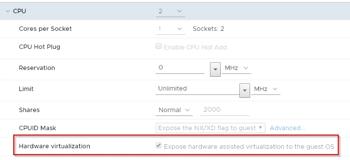

# Building a QEMU Template Constructor

The Nutanix AHV VM format is based on QEMU.  In order to build VMs for the AHV platform, you need to provision a VM with the appropriate settings.

* Due to a bug in Red Hat, the two SCSI controller options (scsi and virtio-scsi) can't be used.  Unfortunately, the default controller in Nutanix is the virtio-scsi controller.
* The stable release of Debian doesn't have a recent enough version of QEMU associated with it, so the unstable release was used

## Setup

1. Create a Virtual Machine in VirtualBox and ensure that the settings for Nested Virtualisation are enabled
    
2. Provision the virtual machine
3. Confirm that virtualisation features are exposed in the VM
    ``` shell
    lscpu | grep Virtualization
    ```
4. Install the core QEMU tools
    ``` shell
    # Debian
    # Update current packages
    apt update

    # Install QEMU
    apt install qemu qemu-kvm
    ```
5. At this point, you should be able to create VMs
6. Install packer
    ``` shell
    # Install wget
    apt install -y wget

    # Download packer
    wget https://releases.hashicorp.com/packer/1.3.5/packer_1.3.5_linux_amd64.zip

    # Install unzip
    apt install -y unzip

    # Unzip packer zip file
    unzip packer_1.3.5_linux_amd64.zip
    ```
7. If you intend to build VMs with headerless mode set to false, then you will need to install a GUI.  To the right is the commands to install the GNOME desktop interface
    ``` shell
    # Install GNOME Desktop
    apt -y groups install "GNOME Desktop"
    ```

## Building a Template

1. Transfer installation media to the QEMU server
2. Stage files for creating the template via packer on the QEMU server
3. Run packer pointing to the json file
    ``` shell
    ./packer build quemu-centOS-7-base.json
    ```
4. If successful, output similar to this will happen

    .webp)
