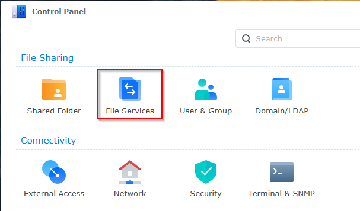
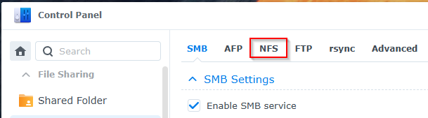
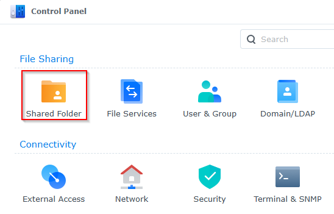
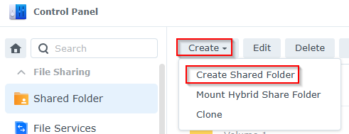
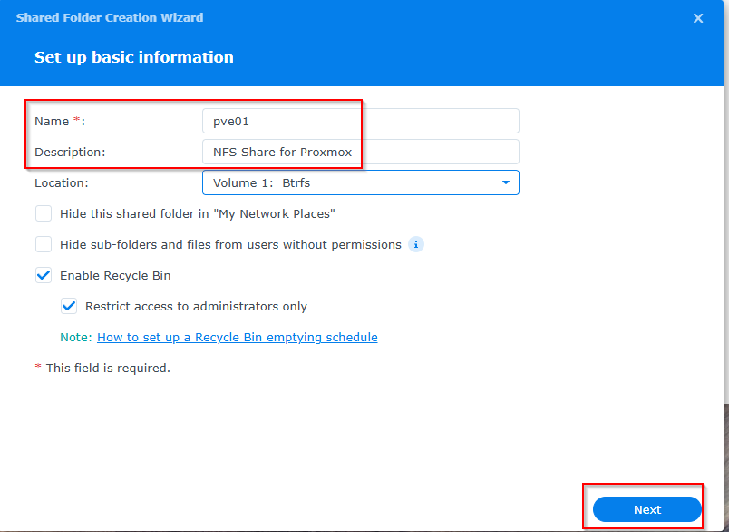
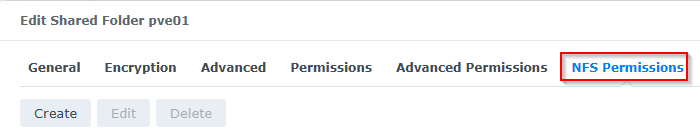
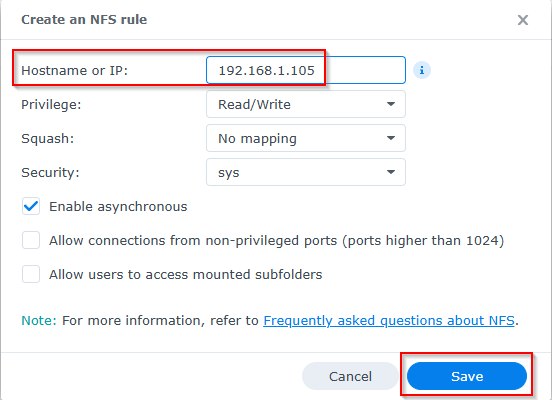
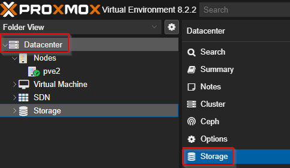
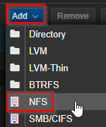
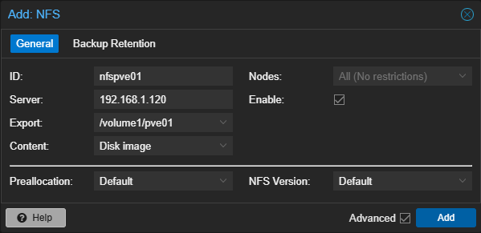

# Adding a Synology NAS NFS Share to Proxmox

## Create & Configure NFS

### Enable NFS

1. Log into the Synology NAS with an admin account

2. Open the Control Panel

3. Click on File Services

    

4. Click on the NFS tab

    

5. Click on the Enable NFS checkbox if it's not already enabled.  Click Apply.

### Create Shared Folder

1. Navigate to Control Panel > Shared Folder

    

2. Click on Create -> Create Shared Folder

    

3. Enter a name and description.  Click Next

    

4. Enable encryption if desired.  Click Next

5. Leave the data checksum item unchecked.  Click Next

6. Review the Confirm Settings screen and click Next

7. Configure the user permissions and click Apply

8. Select the new Share and click Edit

9. Click on the `NFS Permissions` tab

    

10. Click on the Create button
11. Enter the IP/hostname of the Proxmox server that will be using the share.  The other values can be left as is.  Click Save.

    

12. Repeat for any additional servers.  Note the value of the Mount Path at the bottom of the window.  Click Save again

### Configure Proxmox

1. Login to Proxmox
2. Select Datacenter, then Storage

    

3. Click on Add -> NFS

    

4. Fill the details in the window that appears.  The ID will be the name of the share in Proxmox.  The server is the IP/hostname of the Synology NAS.  The Export is the Mouth Path mentioned earlier (the dropdown should populate with available shares).  Configure the other items as required and click Add.

    

5. The NFS Share is now available for use on the Proxmox host.  Repeat for other NFS Shares as required.

/volume1/pve01